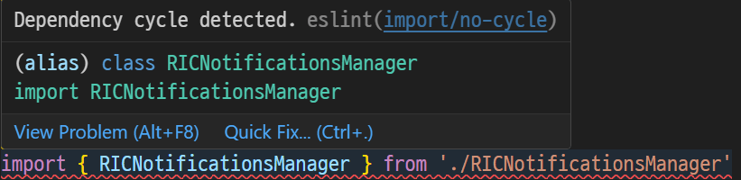
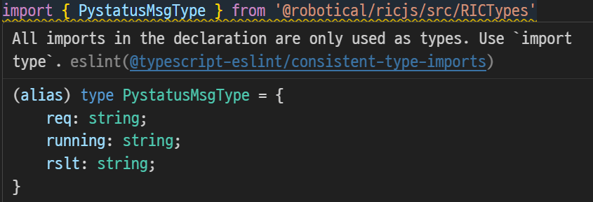
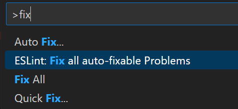

# HW PET TEMPLATE

This GitHub repository collects hardware control programs that are integrated with the AI Codiny service.

The subfolders in this repository contain source code for independent deployable web pages, each integrating with a specific hardware.

To add hardware to the AI Codiny service, it is recommended to copy and modify one of the subfolders.

## Hardware examples

The currently registered hardware includes the following:

- [very-basic-example](./very-basic-example/README.md) - An example containing the minimum basic implementation.

- [marty](./marty/README.md) - Code for controlling the `Marty` hardware.

## Code Deployment

The code written by each company is deployed to the AI Codiny server by the AI Codiny administrator. If you wish to deploy, please send a deployment request email.

When deploying, the AI Codiny administrator executes the `_export.sh` command. Before sending the deployment request email, please execute `_export.sh` to ensure there are no issues.

## Development Guidelines

In general, we do not interfere with the source code of each company. It just needs to work.

However, it is recommended to run lint on the source code before committing.

```sh
cd main
pnpm lint
```

### eslint Rules Recommended

It is not mandatory, but please adhere to `eslint rules`` to avoid potential bugs.

If you want to modify eslint rules, you can do so in the `main/.eslintrc.js` file.
Of course, you can also `disable` eslint rules.

```js
// file: main/.eslintrc.js

module.exports = {
  extends: ["custom/next"],
  // ...
  rules: {
    "no-lonely-if": "off",
    "no-empty": "off",

    // add your rules
  },
};
```

#### Dependency Cycle

A `dependency cycle error` should be fixed as it can lead to memory leaks.

The following code is an example of the dependency cycle issue. Two modules are importing each other.

```javascript
// file: RICNotificationsManager.ts
import { MartyConnector } from "./MartyConnector";
export class RICNotificationsManager {
  // ...
}
```

```javascript
// file: MartyConnector.ts
import { RICNotificationsManager } from "./RICNotificationsManager";
export class MartyConnector {
  // ...
}
```

If you have lint rules enabled in `vscode`, you will see the following error message.



Please fix it using other methods, such as using interfaces.

#### Type import



위의 `eslint warning`은 아래와 같이 수정할 수 있습니다.

```javascript
import type { PystatusMsgType } from "@robotical/ricjs/src/RICTypes";
```

타입스크립트는 자바스크립트로 transpile 되면서 타입 정보가 제거 되므로 `dependency-cycle` 문제가 발생하지 않습니다. 그래서 위와 같이 타입만 사용할 때는 `import type` 을 사용하는 것이 좋습니다.

When TypeScript is transpiled into JavaScript, type information is removed. Therefore, when importing only types, dependency-cycle issues do not occur. Thus, it is advisable to use import type when dealing exclusively with types.

In `VSCode`, you can easily address this using the `eslint fix all` command.



It is convenient to set up a shortcut key for this in VSCode.

End.
