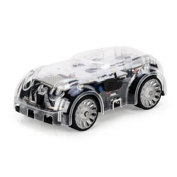

# AltinoLite



AltinoLite

## Technical stacks

- nodejs@20
- nextjs@14
- react@18
- worspace with turborepo
- pnpm
- typescript@5
- @mui/material@5

## Build and Run

```sh
pnpm install

# run dev mode
pnpm dev

# open url http://localhost:3000
```

## 명령어 예시

```js
await hw.foo(); // response 'bar'
await hw.echo('hello'); // response 'hello'
```

## 폴더 구조

- `main/`
  - 코디니 서비스 내에 임베딩될 iframe의 내용 부분입니다.
  - NextJS로 작성된 웹페이지의 소스코드입니다.
- `sub/eslint-config/`
  - eslint 설정이 포함되어 있습니다.
- `sub/typescript-config/`
  - TypeScript 설정이 포함되어 있습니다.
- `sub/ui/`
  - UI 컴포넌트 및 간단한 유틸리티 함수들이 포함되어 있습니다.

## 소스 코드 수정

- 기본적으로 `sub/` 폴더는 수정할 필요가 없습니다.
- 하지만 규모가 큰 프로젝트의 경우 기능의 일부를 라이브러리로 만들어 `sub/` 폴더에 넣을 수 있습니다.
  - 이 프로젝트는 `sub/alitinolite-ble` 라이브러리를 추가하였습니다.
- `main/` 폴더의 소스코드에서 수정할 부분은 다음과 같습니다.
  - `main/public/logo.png` - 하드웨어 이미지 파일
  - `main/src/constants.ts` - 하드웨어 ID 설정
  - `main/src/hw/CommandRunner.ts` - 하드웨어 제어 명령들 추가하는 곳

수정할 내용은 `main/` 폴더의 세 파일이 전부입니다.

### 하드웨어 이미지 파일 등록

하드웨어 이미지를 교체하기 위해 아래 경로에 있는 이미지를 교체해주세요. 파일명은 `logo.png` 로 해야 합니다.

- `main/public/logo.png`
- 이미지의 높이는 `200px`로 설정해야 합니다. `200px`이 아닌 경우 승인이 거부됩니다. 이미지의 너비는 `150~300px`이 적당합니다.

### 하드웨어의 ID와 이름

`main/src/constants.ts` 파일에서 하드웨어 ID와 이름을 설정해주세요.

```js
// file: src/constant.ts

/**
 * hardware id
 */
export const HW_ID = 'saeonAltinoLite-ble';

/**
 * hardware name
 */
export const HW_NAME = {
  en: 'Altino Lite',
  ko: '알티노 라이트',
};
```

- 하드웨어 ID는 원하는 ID로 설정할 수 있으나, 규칙에 어긋난 경우 승인이 거부됩니다.
- 영문 소문자로 시작하며 camelCase 규칙으로 설정해주세요.
- `web ble`로 연결하는 경우 하드웨어 ID는 `-ble`로 끝나야 합니다.
- `web serial`로 연결하는 경우 하드웨어 ID는 `-serial`로 끝나야 합니다.

### 하드웨어 제어 명령 추가

`CommandRunner.ts` 파일은 연결과 제어 명령과 관련한 내용들을 포함하고 있습니다. 명령들을 추가하기 위해 이 파일을 수정하세요.

아래는 구현해야 하는 최소한의 내용입니다.

```js
// file: main/src/hw/CommandRunner.ts

/**
 * 하드웨어에 명령을 보내는 클래스
 * 필요한 명령어들을 추가하세요.
 * 메서드의 이름이 명령어입니다. 예를 들어 블록코딩에서 move라는 명령어를 실행하려면 move() 메서드를 작성하시면 됩니다.
 *
 * 라이프 사이클 메서드: init(), destroy()
 * 필수 구현 메서드: getConnectionState(), getHwId(), connect(), disconnect()
 * 위에 언급한 메서드 이외의 메서드들은 추가적인 명령어들입니다.
 */
export class CommandRunner implements IHPetCommandRunner {
  /**
   * 라이프 사이클 메서드, 자동으로 호출됩니다.
   * 반드시 구현해야 하는 메서드입니다.
   * 부모 프레임(CODINY)과 통신하기 전에 한번 호출됩니다.
   * 이벤트 리스너 등록 같은 초기화 관련 코드를 작성하기에 적합니다.
   * 구현할 게 없다면, 빈 메서드로 남겨두세요.
   */
  init = async (): Promise<void> => {
    log.debug('CommandRunner.init()')
  }

  /**
   * 라이프 사이클 메서드, 자동으로 호출됩니다.
   * 반드시 구현해야 하는 메서드입니다.
   * 하드웨어와의 연결이 끊어진 후에 한번 호출됩니다.
   * 이벤트 리스너 해제 같은 리소스 정리 관련 코드를 작성하기에 적합합니다.
   */
  destroy = async () => {
    log.debug('CommandRunner.destroy()')
  }


  /**
   * 명령어: getConnectionState
   *
   * 현재의 연결 상태를 반환
   * 반드시 구현해야 하는 메서드입니다.
   * 이 메서드의 반환값은 자동으로 부모 프레임(CODINY)에 전달됩니다.
   * @returns ConnectionState - connection state
   */
  getConnectionState = async (): Promise<ConnectionState> => {
    // ...
  }

  /**
   * 명령어: getHwId
   *
   * 하드웨어 ID를 반환
   * 반드시 구현해야 하는 메서드입니다.
   * 메서드의 반환값은 자동으로 부모 프레임(CODINY)에 전달됩니다.
   * @returns string - hwId
   */
  getHwId = async (): Promise<string> => {
    // ...
  }

  /**
   * 명령어: connect
   *
   * 하드웨어에 연결
   * 반드시 구현해야 하는 메서드입니다.
   * @returns 반환값은 의미 없습니다.
   */
  connect = async (): Promise<boolean> => {
    await fakeConnect()

    // When changing the connection state, be sure to call updateConnectionState_()
    this.updateConnectionState_('connected')
    return true
  }

  /**
   * 명령어: disconnect
   *
   * 하드웨어와의 연결을 종료하는 메서드
   * 반드시 구현해야 하는 메서드입니다.
   */
  disconnect = async () => {
    await fakeDisconnect().catch((err) => {
      // ignore error
    })

    // When changing the connection state, be sure to call updateConnectionState_()
    this.updateConnectionState_('disconnected')
  }
}

```

#### 연결 상태 리스너

- 연결 상태 리스너 같은 이벤트 리스너들은 `init()` 에서 등록하는 것을 권장합니다.
- 그리고 `destroy()` 메서드에서 이벤트 리스너들을 해제하세요.

예를 들면, 아래와 같이 할 수 있습니다.

```js
export class CommandRunner implements IHPetCommandRunner {
  // ...

  init = async (): Promise<void> => {
    // 이벤트 리스너 등록
  }


  destroy = async () => {
    // 이벤트 리스너 해제
  }
}

```

#### 명령어 추가

필요할 명령어들을 `CommandRunner.ts` 파일에 추가하세요. 예를 들면 아래와 같이 할 수 있습니다.

```js
// file: main/src/hw/CommandRunner.ts

export class CommandRunner implements IHPetCommandRunner {

  // ... omit

  /**
   * 명령어: foo
   *
   * 메서드의 반환값은 자동으로 부모 프레임(CODINY)에 전달됩니다.
   * @returns 'bar'
   */
  foo = async (): Promise<string> => {
    return 'bar'
  }

  /**
   * 명령어: echo
   *
   * 메서드의 반환값은 자동으로 부모 프레임(CODINY)에 전달됩니다.
   * @param what - string to echo
   * @returns echo string
   */
  echo = async (what: string): Promise<string> => {
    return what
  }
}
```

## IFRAME 플레이 그라운드에서 테스트

- 코디니 블록 공작소의 IFRAME 플레이 그라운드에서 실행해볼 수 있습니다.
- 동작하는 하드웨어를 준비하세요.
- 아래의 주소에 접속하여 IFRAME URL을 `http://localhost:3000`으로 입력하여 테스트 할 수 있습니다.
  - https://aicodiny.com/simul/hw-playground
- 코디니의 블록 공작소에 등록한 블록이 없어도 IFRAME 플레이 그라운드에서 테스트 할 수 있습니다.

### 데모 영상

IFRAME 플레이그라운드 데모 영상을 참고해주세요.

- `Marty`라는 하드웨어가 코디니와 연동하여 실행되는 영상입니다.
- 개발자의 로컬 호스트에서 코디니 운영 서버가 연동하는 과정을 확인할 수 있습니다.

- Marty Playground 데모
  - https://www.youtube.com/watch?v=89DEb8h49EA
- Marty 실행 데모
  - https://www.youtube.com/watch?v=ZYi-DQNnnLQ

End.
